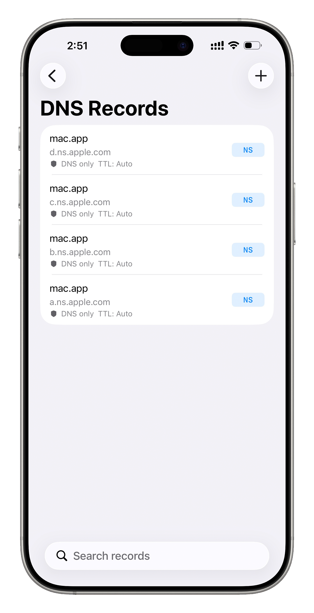
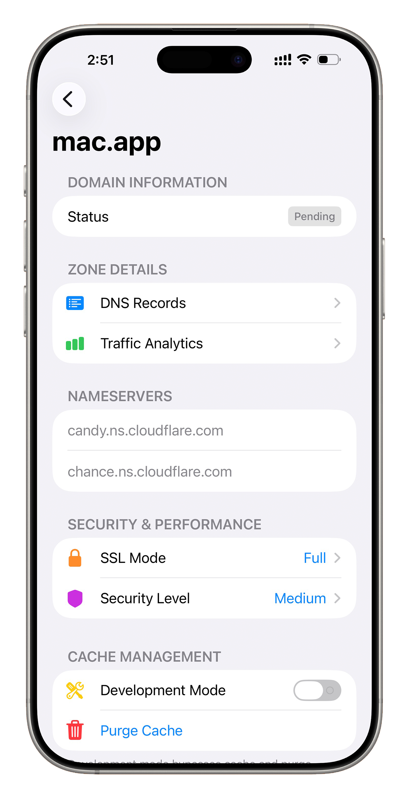
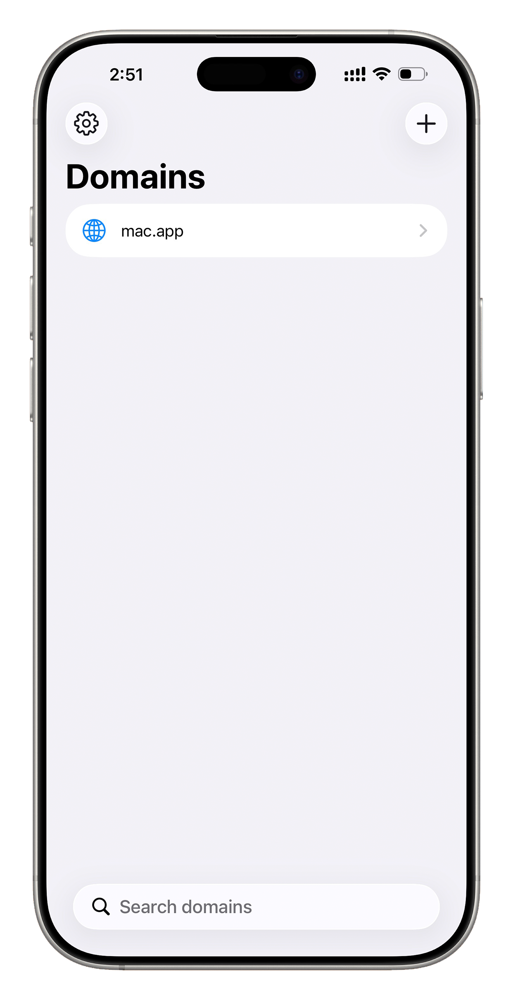
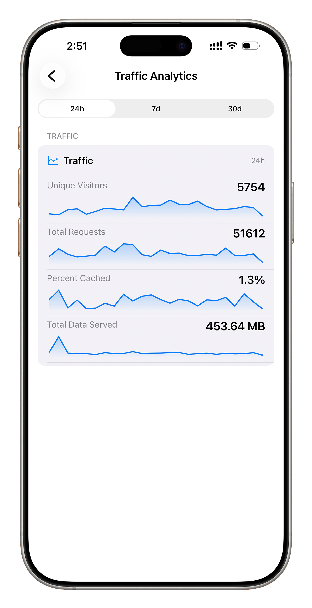

# CFlareDNS

[](https://developer.apple.com/ios/)
[](https://polyformproject.org/licenses/noncommercial/1.0.0)
[](https://api.cloudflare.com/)
[](https://apps.apple.com/app/id6758071138)
[](https://testflight.apple.com/join/3DtJwCzt)
[](https://github.com/sponsors/missuo)

**CFlareDNS** is a lightweight, secure, and powerful iOS application designed for managing your Cloudflare domains and DNS records on the go. Built with native performance in mind, it provides a seamless experience for developers and system administrators to monitor and tweak their network settings anytime, anywhere.

## 📱 Screenshots

<p align="center">
  
  
  
  
</p>

## ✨ Features

- **Multi-Account & API Tokens**: Manage multiple Cloudflare accounts and sign in with either a **Global API Key** or a scoped **API Token**.
- **Zone Management**: View all your domains at a glance, check their status, and add new zones easily.
- **DNS Record Editor**: Full CRUD (Create, Read, Update, Delete) support for DNS records including A, AAAA, CNAME, MX, TXT, and more.
- **Real-time Analytics**: Monitor your website traffic, requests, and bandwidth usage with intuitive charts.
- **Security Controls**: Toggle SSL/TLS modes, adjust Security Levels (e.g., "Under Attack" mode), and manage Development Mode.
- **Cache & Performance**: Tune Brotli, Always Online, Cache Level, and Browser Cache TTL, and purge everything or specific URLs in a single tap.
- **Workers & KV**: Browse your account's Worker scripts and KV namespaces, and manage per-domain Worker Routes.
- **Privacy First**: Credentials (Email, API Key, or API Token) are stored locally in the **iOS Keychain** and are never sent to any third-party server except Cloudflare.

## 🚀 Getting Started

### Prerequisites

- An iOS device running iOS 16.0 or later.
- A Cloudflare account.
- A Cloudflare **Global API Key** or **API Token**.

### Installation

1. Clone the repository:
   ```bash
   git clone https://github.com/missuo/FlareDNS.git
   ```
2. Open `FlareDNS.xcodeproj` in Xcode.
3. Select your target device or simulator.
4. Build and Run (`Cmd + R`).

## 🔒 Security

We take your security seriously. CFlareDNS uses the **System Keychain** to store your Cloudflare API credentials. This ensures:
- Your keys are encrypted at rest.
- Your keys are not included in device backups (unless encrypted).
- No data is ever uploaded to our own servers.

### 🛡️ Safety & Compliance

CFlareDNS interacts directly with the **official Cloudflare API** and strictly adheres to the [Cloudflare API Documentation](https://developers.cloudflare.com/api/). 
- **No Account Risk**: All actions are performed via authenticated requests using your own credentials.
- **Official Integration**: There is zero risk of account suspension or bans, as the app operates as a standard API client within Cloudflare's supported development framework.

## 💖 Support the Project

If you find CFlareDNS helpful, consider supporting its development!

- **Sponsor via GitHub**: [@missuo](https://github.com/sponsors/missuo)
- **Star the repo**: It helps more people discover the tool.

## 🤝 Contributing

Contributions are welcome! Please feel free to submit a Pull Request.

1. Fork the Project
2. Create your Feature Branch (`git checkout -b feature/AmazingFeature`)
3. Commit your Changes (`git commit -m 'feat: add some AmazingFeature'`)
4. Push to the Branch (`git push origin feature/AmazingFeature`)
5. Open a Pull Request

### 💡 PRs We'd Love to See

We especially welcome contributions that benefit most users — broadly useful, mainstream features such as:

- 🌐 **Localization (i18n)** — translations so the app feels native in more languages.
- 📲 **Home Screen Widgets** — at-a-glance traffic stats or one-tap shortcuts.
- 🔍 **DNS Search & Filtering** — quickly find records in large zones.
- 🔔 **Push Notifications** — alerts for traffic spikes or certificate/expiry changes.
- 🗂️ **Bulk Import / Export** — import or export DNS records (e.g. BIND zone files).
- ⌚ **Apple Ecosystem** — Siri Shortcuts / App Intents, plus iPad and Mac layout polish.

## 🙏 Acknowledgments

- Special thanks to **Simon Mao** for designing the App Icon.

## 📄 License

Distributed under the **PolyForm Noncommercial License 1.0.0**. See [`LICENSE`](./LICENSE) for the full text.

> **Note:** This is a **source-available, _noncommercial_** license. It is **not** an OSI-approved "open source" license, because it forbids commercial use.

### ✅ You are free to

- **Use, study, and run** the app for **any noncommercial purpose** — personal projects, learning, research, education, nonprofits, and similar.
- **Modify the source** and **build derivative works** for those same noncommercial purposes.
- **Share** the app and your changes, as long as you follow the conditions below.

### ❌ You may not

- **Use it commercially** in any form — including selling it, bundling it into a paid product or service, running it as part of a business, or any other use intended for commercial advantage or monetary compensation.
  *(Need a commercial license? Open an issue or contact the author.)*

### 📌 If you fork or build on it, you must

1. **Keep the license.** Ship the full `LICENSE` text and the `Required Notice:` line with every copy, changed or not.
2. **Credit the original — one of these is required:**
   - **Keep the original name** (`FlareDNS`); **or**
   - If you rename it, **clearly credit the original author (Vincent Yang) and link back to the original repository** (`https://github.com/missuo/FlareDNS`) in your README and/or About screen.

In other words: you can fork it and even rename it, but you can **never** strip the attribution, and you can **never** use it for commercial purposes.

---
*Disclaimer: This app is not affiliated with, sponsored by, or endorsed by Cloudflare, Inc.*
