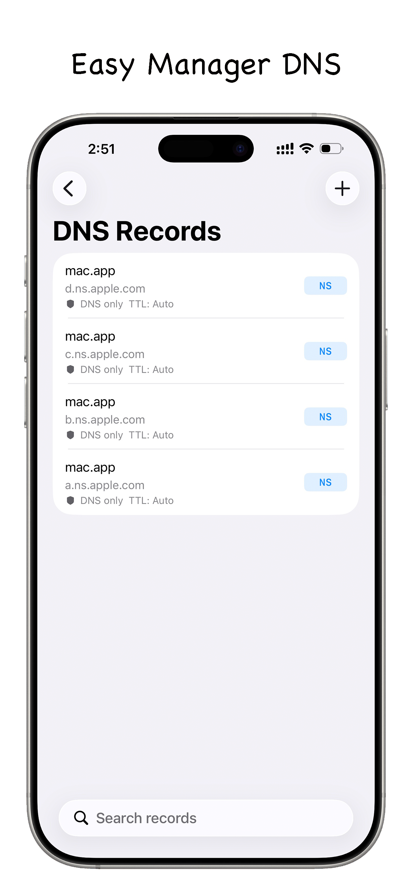
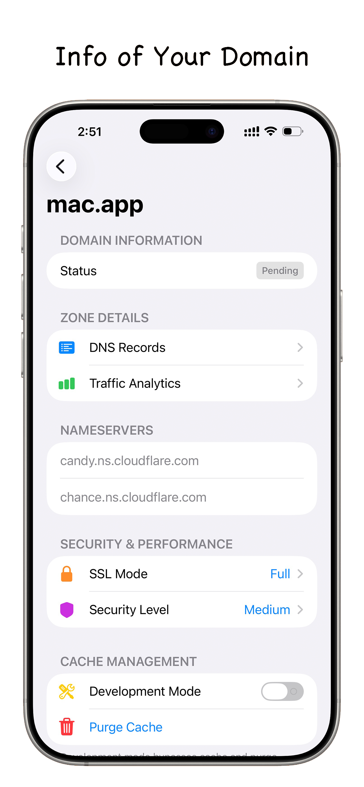
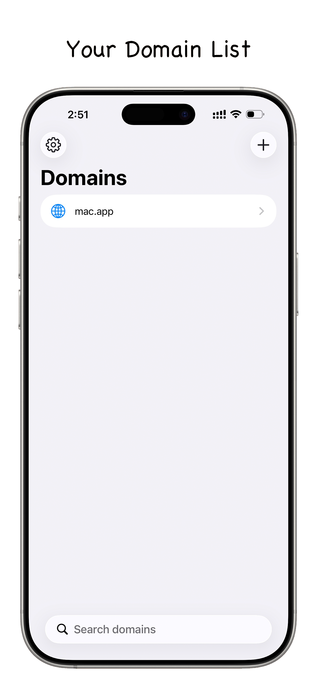
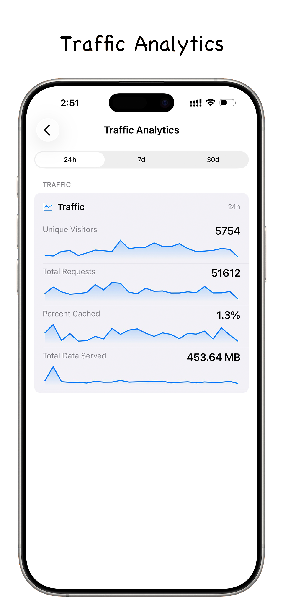

# CFlareDNS

[](https://developer.apple.com/ios/)
[](https://opensource.org/licenses/MIT)
[](https://api.cloudflare.com/)
[](https://apps.apple.com/app/id6758071138)
[](https://testflight.apple.com/join/3DtJwCzt)

**CFlareDNS** is a lightweight, secure, and powerful iOS application designed for managing your Cloudflare domains and DNS records on the go. Built with native performance in mind, it provides a seamless experience for developers and system administrators to monitor and tweak their network settings anytime, anywhere.

## 📱 Screenshots

<p align="center">
  
  
  
  
</p>

## ✨ Features

- **Zone Management**: View all your domains at a glance, check their status, and add new zones easily.
- **DNS Record Editor**: Full CRUD (Create, Read, Update, Delete) support for DNS records including A, AAAA, CNAME, MX, TXT, and more.
- **Real-time Analytics**: Monitor your website traffic, requests, and bandwidth usage with intuitive charts.
- **Security Controls**: Toggle SSL/TLS modes, adjust Security Levels (e.g., "Under Attack" mode), and manage Development Mode.
- **Cache Management**: Purge your Cloudflare cache with a single tap to ensure your users always see the latest content.
- **Privacy First**: Sensitive API credentials (Email & API Key) are stored locally in the **iOS Keychain** and are never sent to any third-party server except Cloudflare.

## 🚀 Getting Started

### Prerequisites

- An iOS device running iOS 16.0 or later.
- A Cloudflare account.
- A Cloudflare **Global API Key** or **API Token**.

### Installation

1. Clone the repository:
   ```bash
   git clone https://github.com/missuo/FlareDNS.git
   ```
2. Open `FlareDNS.xcodeproj` in Xcode.
3. Select your target device or simulator.
4. Build and Run (`Cmd + R`).

## 🔒 Security

We take your security seriously. CFlareDNS uses the **System Keychain** to store your Cloudflare API credentials. This ensures:
- Your keys are encrypted at rest.
- Your keys are not included in device backups (unless encrypted).
- No data is ever uploaded to our own servers.

## 🤝 Contributing

Contributions are welcome! Please feel free to submit a Pull Request.

1. Fork the Project
2. Create your Feature Branch (`git checkout -b feature/AmazingFeature`)
3. Commit your Changes (`git commit -m 'feat: add some AmazingFeature'`)
4. Push to the Branch (`git push origin feature/AmazingFeature`)
5. Open a Pull Request

## 📄 License

Distributed under the MIT License. See `LICENSE` for more information.

---
*Disclaimer: This app is not affiliated with, sponsored by, or endorsed by Cloudflare, Inc.*
